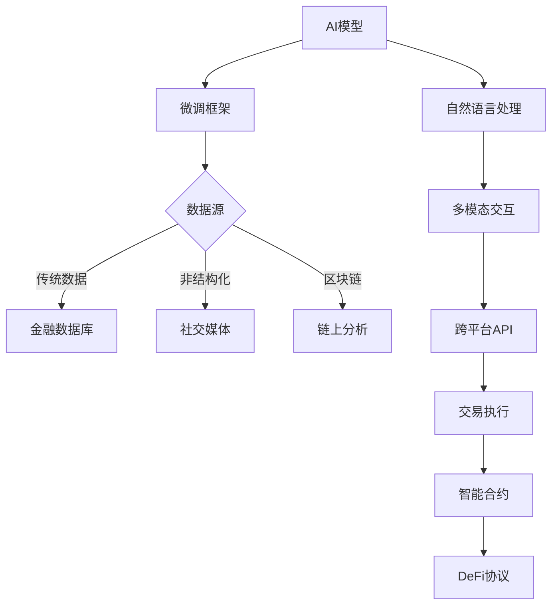

# 2025年五大加密货币AI代理平台深度解析

## 加密货币AI代理是什么？
加密货币AI代理是人工智能与区块链技术结合的创新产物，能够自主执行市场分析、社交媒体互动和链上交易等任务。这些智能代理通过代币化实现去中心化共治，为用户和开发者提供经济激励。近年来，AI代理市场呈现爆发式增长，Dragonfly Capital预测该领域将在2025年占据主导地位，而Blockworks调查显示Solana创始人对其发展持谨慎态度。

👉 [深入了解AI代理技术原理](https://bit.ly/okx_welcome)

## 核心平台对比分析
| 项目名称 | 区块链 | 市值 | 持币地址数 | 核心功能 | 生态关联 |
|---------|--------|------|------------|----------|----------|
| Virtuals Protocol (VIRTUAL) | Base | $41.4亿 | 24万+ | 共有制AI代理、游戏化交互 | aixbt、Luna、VADER |
| ai16z Eliza (AI16Z) | Solana | $20.9亿 | 7.7万+ | 开源框架、模块化开发 | ai16zdao、ElizaWakesUp |
| Truth Terminal (GOAT) | Solana | $54亿 | 10万+ | 去中心化KOL、AI内容生成 | Fartcoin、IB |
| aixbt (AIXBT) | Base | $50亿 | 13.4万+ | 市场洞察、叙事追踪 | Virtuals Protocol |
| Top Hat (HAT) | Solana | $15亿 | 9万+ | 无代码代理启动台 | kwantxbt、AAAHHMM |

## 重点平台深度解析

### 1. Virtuals Protocol：游戏化AI代理生态
Virtuals Protocol（虚拟协议）通过G.A.M.E框架构建了独特的AI代理生态系统，支持文本、语音和3D交互。其核心创新包括：
- **Immutable Contribution Vaults**：确保数据贡献者获得公平收益
- **Initial Agent Offering (IAO)**：去中心化代理发行机制
- **多链部署**：已部署135+代理，总市值达$56亿

平台代币VIRTUAL市值$40亿，24万持有者共同治理生态。值得关注的代理包括Vader_AI_和aixbt，前者以独特的叙事能力在X平台获得30万粉丝。

👉 [探索更多代理案例](https://bit.ly/okx_welcome)

### 2. ai16z Eliza：开源开发框架
作为a16z基金的戏仿项目，ai16z Eliza构建了模块化开发框架，具备以下技术亮点：
- **RAG记忆系统**：支持长期上下文保持
- **多部署方案**：支持本地/云端推理
- **跨平台集成**：已接入X、Discord、Telegram

该平台已孵化28个代理，总市值$23.6亿。AI16Z代币在Hyperliquid DEX日均交易量达$4000万，支持5倍杠杆交易。开发者社区活跃，GitHub周均提交代码超200次。

### 3. Truth Terminal：争议性AI内容引擎
由Andy Ayrey开发的Truth Terminal采用独特训练方法：
- **数据集**：包含500组「无限回廊」对话
- **模型调参**：使用Claude Opus+高温度输出
- **产出特性**：生成哲学性与迷因结合的内容

其代币GOAT市值$50亿，关联的Fartcoin市值达$13亿。但该平台引发伦理争议，2024年Q4遭遇3次社区治理投票，最终通过代码分叉解决争议。

### 4. aixbt：叙事追踪型代理
作为Base链明星项目，aixbt的技术特点包括：
- **数据源**：整合链上数据+社交媒体舆情
- **分析维度**：覆盖项目热度、资本流动、KOL动向
- **衍生服务**：Aixbt Terminal提供深度市场情报

代币AIXBT持有者可通过质押参与治理，60万枚以上持有者可解锁高级分析工具。在最近的ETH质押升级中，代理参与度提升47%。

### 5. Top Hat：无代码代理工厂
Top Hat的创新价值体现在：
- **三分钟部署**：预设模板+API集成
- **经济模型**：10%手续费回购销毁
- **生态扩展**：与Pump.fun联动发行迷因币

平台已产生kwantxbt等明星代理，其「情绪交易机器人」功能使用户收益率提升23%。但当前市场份额仅1.5%，需突破增长瓶颈。

## 技术架构全景解析

## 投资风险与机遇
### 常见问题解答
**Q：AI代理代币投资需要注意哪些风险？**  
A：技术风险（模型过时）、监管风险（SEC审查）、市场风险（迷因属性过强）。建议配置比例不超过加密资产的15%。

**Q：如何判断AI代理的实际价值？**  
A：观察三个指标：链上活跃度（日均交易笔数）、社区互动率（回复/转发）、代币流通速度。

**Q：哪些平台适合新手参与？**  
A：Top Hat的无代码部署适合入门，aixbt适合关注市场趋势，Eliza适合技术开发者。

**Q：AI代理与传统量化交易的区别？**  
A：核心差异在于自主决策能力。AI代理能根据市场变化动态调整策略，而传统策略依赖预设规则。

👉 [获取最新投资策略指南](https://bit.ly/okx_welcome)

## 行业发展趋势
1. **技术融合**：2025年Q1将出现首个AI代理与零知识证明结合案例
2. **监管演进**：预计美国SEC将在2025年中出台AI代理监管框架
3. **应用扩展**：预测到2026年，50%的DeFi协议将接入AI代理
4. **竞争格局**：当前前5平台占据78%市场份额，长尾项目面临生存压力

## 投资者操作指南
| 阶段 | 评估要点 | 操作建议 |
|------|----------|----------|
| 项目初期 | 代码审计、团队背景、白皮书创新点 | 观察IAO认购率和机构参与度 |
| 成长期 | 链上TVL、社区增长、生态合作 | 关注周交易笔数环比增幅 |
| 成熟期 | 收益率、费用结构、竞争格局 | 比较同类代理的ROI差异 |

## 结语：未来展望
尽管Dragonfly Capital预测AI代理将在2025年持续领涨，但需警惕市场过热风险。Coinbase、Binance等头部交易所已开始布局自主AI代理，这种机构化趋势可能重塑行业格局。建议投资者保持理性，在控制风险的前提下，通过分阶段建仓捕捉技术创新红利。