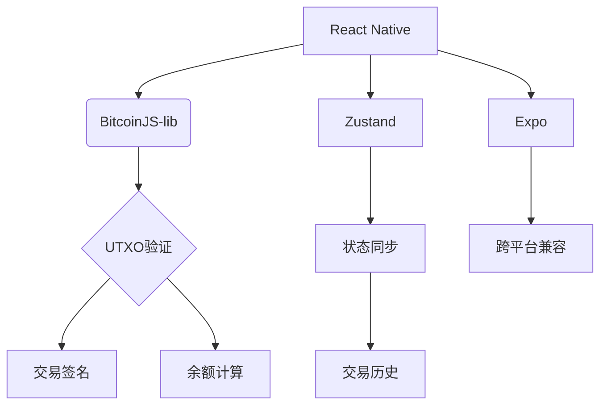

# 从零开始开发比特币钱包的4个月：我的技术成长全记录

## 开发历程总览

我独自一人花费4个月时间开发了一个比特币钱包，通过Twitch和Twitter全程直播开发过程。这个测试网络专用的实验性项目虽然功能粗糙但运行正常，其价值在于让我对系统工程和自我认知有了突破性提升。该项目采用[BitcoinJS-lib](https://github.com/bitcoinjs/bitcoinjs-lib)核心库，配合React Native框架构建跨平台移动应用。

👉 [了解区块链技术应用](https://bit.ly/okx_welcome)

## 项目起源

此前开发的去中心化比特币托管服务BitEscrow让我深刻认识到：大众对比特币的消费意愿远低于预期。在经历3年创业后，我用270小时的《异星工厂》游戏时间重新审视系统工程思维。这款工业模拟游戏让我领悟到：工程优化的核心在于系统性思考而非单点突破。这种认知转变促使我重新投入技术基础设施开发。

### 技术转型动机
- 重新验证比特币基础设施开发价值
- 通过实践深化密码学理解
- 探索AI辅助开发模式
- 建立完整的区块链技术知识体系

## 开发决策分析

### 功能取舍原则
在开发过程中，我制定了严格的功能筛选标准：
| 取舍维度 | 保留功能 | 舍弃功能 |
|---------|---------|---------|
| 核心价值 | 交易收发 | 价格显示 |
| 安全等级 | 种子词管理 | 第三方认证 |
| 技术深度 | UTXO验证 | UI动效 |
| 工程效率 | 状态管理 | CI/CD体系 |

👉 [探索数字资产安全方案](https://bit.ly/okx_welcome)

### 关键技术突破
1. **交易构造**：实现从UTXO选择到签名验证的完整流程
2. **HD钱包**：基于BIP-32/BIP-39标准的种子派生系统
3. **跨平台兼容**：通过Expo解决Android/iOS系统差异
4. **状态管理**：使用Zustand构建响应式数据流

## 开发心路历程

### 危机时刻
第三个月遭遇重大瓶颈：
- Kanban看板积压37项待办任务
- API调用频次突破CoinGecko限制
- UI组件库版本冲突导致构建失败
- 安全审计发现私钥存储漏洞

👉 [学习区块链开发技巧](https://bit.ly/okx_welcome)

### 系统思维转变
开发后期实现认知跃迁：
- 从代码逻辑转向系统架构
- 从功能实现转向流程优化
- 从技术细节转向工程管理
- 从单点突破转向体系构建

## 技术架构解析

### 核心技术栈

### 开发工具链
| 类别       | 技术选型          | 选择理由                  |
|------------|-------------------|---------------------------|
| 构建工具   | Expo              | 快速原型开发              |
| 状态管理   | Zustand v5.0.4    | 简洁高效的响应式系统      |
| 网络请求   | Axios+Zod         | 类型安全的数据验证        |
| 存储方案   | MMKV              | 高性能本地存储            |
| 数据查询   | React Query       | 异步数据管理              |

## 开发经验总结

### 技术启示
1. **密码学实践**：实现secp256k1椭圆曲线签名加深了对非对称加密的理解
2. **状态复杂度**：金融应用的状态管理需要达到军工级严谨度
3. **API设计**：RESTful接口在区块链场景的特殊优化需求
4. **性能瓶颈**：移动设备上的加密运算优化策略

### 个人成长
1. **工程哲学**：完美主义阻碍项目推进，持续交付才是核心
2. **技术定位**：确认自己更适合底层系统开发而非前端设计
3. **学习曲线**：4个月实践胜过4年理论学习
4. **协作模式**：AI辅助开发显著提升开发效率

## 常见问题解答

### Q1：为何选择BitcoinJS-lib而非其他库？
A：作为入门级项目，BitcoinJS提供细粒度的API控制，有助于深入理解比特币协议细节。虽然BDK等现代框架更易用，但不利于基础学习。

### Q2：如何保证钱包安全性？
A：采取多层防护措施：
- 内存加密存储私钥
- 双因素备份验证
- 离线签名流程
- 定期安全审计

### Q3：开发过程中最大的技术挑战？
A：UTXO模型的实现复杂度远超预期。需要同时处理：
- 输入选择算法
- 交易费动态计算
- 交易链构建验证
- 零确认交易处理

### Q4：AI在开发中起到什么作用？
A：主要承担代码生成和调试辅助角色：
- 通过Prompt进行架构设计
- 自动化测试用例生成
- 错误日志分析定位
- 文档自动生成

### Q5：为何放弃USD转换功能？
A：该功能带来以下技术债务：
- 第三方API依赖
- 汇率波动处理逻辑
- 历史数据存储需求
- 多币种显示复杂度

## 未来规划

当前项目已实现核心功能，但存在以下待改进领域：
1. **安全强化**：实现硬件钱包集成
2. **性能优化**：改进移动端同步效率
3. **协议扩展**：支持闪电网络协议
4. **生态对接**：集成DeFi协议接口

这个开发历程印证了区块链工程师的成长路径：从协议理解到系统构建，从代码实现到工程管理。希望这个案例能为区块链开发者提供实践参考，帮助理解数字钱包的核心技术架构。